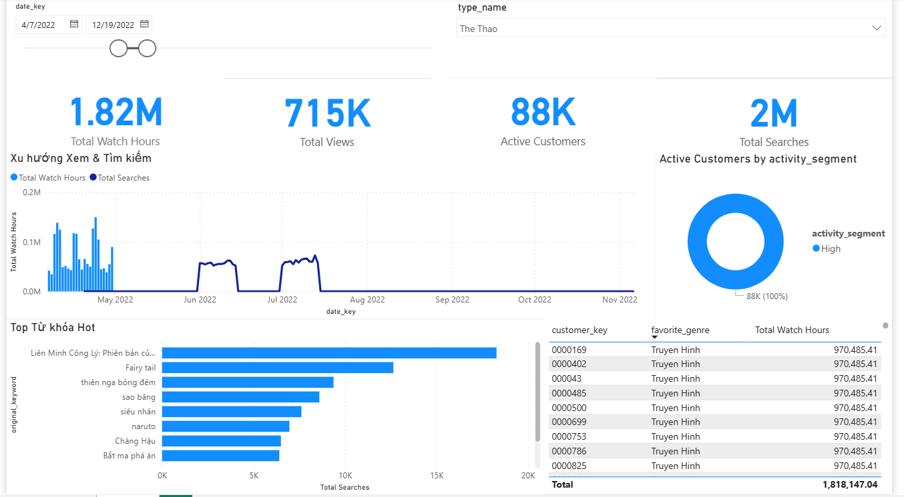

# 📊 Customer 360 & Content Analytics Data Pipeline


## 📖 Project Overview

This project is an **End-to-End Data Engineering Pipeline** designed to process and analyze user interaction logs (Watch History & Search History) for a media streaming platform.

The system ingests raw "dirty" logs, transforms them using **PySpark** (handling complex data quality issues like Thai Buddhist dates), loads them into a **PostgreSQL Data Warehouse** modeled with **Star Schema**, and visualizes insights via a **Power BI** dashboard.

## 🧩 System Architecture

The pipeline runs entirely in a **Dockerized environment**, ensuring consistency and ease of deployment.

```mermaid
graph LR
    %% Definitions
    subgraph Host_Machine ["💻 Host Machine (Windows)"]
        Data_Lake[("📂 Data Lake\n(Local Folders)")]
        PowerBI["📊 Power BI\n(Dashboard)"]
    end

    subgraph Docker_Env ["🐳 Docker Environment"]
        subgraph Container_1 ["PySpark Container"]
            Spark[["🔥 Apache Spark\n(ETL Processing)"]]
        end

        subgraph Container_2 ["PostgreSQL Container"]
            DW[("🐘 Data Warehouse\n(Star Schema)")]
        end
    end

    %% Data Flow
    Data_Lake == "Docker Volume Mount\n(Read Raw JSON/CSV)" ==> Spark
    Spark -- "JDBC Writer\n(Internal Docker Network)" --> DW
    DW -.-> "Port Forwarding (5432)\nImport/Direct Query" -.-> PowerBI

    %% Styling
    style Docker_Env fill:#e1f5fe,stroke:#01579b,stroke-width:2px,stroke-dasharray: 5 5
    style Spark fill:#ffcc80,stroke:#e65100
    style DW fill:#b3e5fc,stroke:#0277bd
    style PowerBI fill:#fff9c4,stroke:#fbc02d
```

## 📂 Project Structure

```bash
Customer_Analytics_App/
│
├── config/                     # Configuration files
│   └── postgresql-42.7.2.jar   # JDBC Driver for Spark-Postgres connection
│
├── data/                       # Data Lake (Local storage)
│   └── raw/
│       ├── log_content/        # Raw Watch logs (CSV)
│       └── log_search/         # Raw Search logs (JSON)
│
├── sql/                        # Database Schema Scripts
│   └── init_schema.sql         # DDL for Star Schema (Auto-run on init)
│
├── src/                        # Source Code
│   ├── __init__.py
│   └── etl_job.py              # Main PySpark ETL Script
│
├── reports/                    # BI Reports
│   └── Customer_360_Insights.pbix
│
├── images/                     # Screenshots for Documentation
│   └── dashboard_demo.png
│
├── docker-compose.yml          # Container Orchestration
├── Dockerfile                  # Custom Spark Image build
├── requirements.txt            # Python dependencies
└── README.md                   # Documentation
```

## 🚀 Key Features & Technical Highlights

### 1. Complex Data Cleaning (PySpark)

- **Thai Date Conversion:** Successfully handled logs using the Thai Buddhist Calendar (e.g., converting year `2565` to `2022`).
- **Numeral Normalization:** Converted non-standard numerals (Persian, Bengali) into standard integers.
- **Data Integrity:** Filtered out logs with NULL keys to ensure Referential Integrity in the Data Warehouse.

### 2. Star Schema Modeling (PostgreSQL)

Designed a dimensional model optimized for analytical queries:

- **Fact Tables:** `fact_watch_activity`, `fact_search_activity`
- **Dimension Tables:** `dim_customer`, `dim_content_type`, `dim_date`, `dim_keyword`
- **Automation:** The `dim_date` table is auto-populated with 10 years of data using SQL `GENERATE_SERIES`.

### 3. Containerization (Docker)

- Used **Docker Compose** to orchestrate Spark and PostgreSQL services.
- Implemented **Volume Mapping** to handle data ingestion without copying files into containers.
- configured **Auto-Initialization** for the database using `docker-entrypoint-initdb.d`.

## 🛠️ How to Run

### Prerequisites

- Docker Desktop installed.
- Power BI Desktop (for viewing reports).

### Step 1: Setup Data & Config

Ensure you have the JDBC driver in the `config/` folder and raw data in `data/raw/`.

### Step 2: Start the Pipeline

Open your terminal in the project root and run:

```bash
docker-compose up --build
```

_This command will start PostgreSQL, initialize the tables, and trigger the PySpark ETL job automatically._

### Step 3: Verify Data

Connect to PostgreSQL using any client (DBeaver, pgAdmin):

- **Host:** `localhost`
- **Port:** `5432`
- **Database:** `customer_dw`
- **User/Pass:** `postgres` / `password`

### Step 4: Visualize

Open `reports/Customer_360_Insights.pbix` in Power BI to view the dashboard.

## 📊 Dashboard Demo

_(Screenshot of the Power BI Dashboard)_



## 👨‍💻 Author

**[YOUR NAME]**

- **Role:** Data Engineer Intern Applicant
- **University:** Ho Chi Minh City Open University
- **Tech Stack:** Python, SQL, Spark, Docker, Power BI
- **Email:** [Your Email Here]
- **LinkedIn:** [Your Profile Link]
